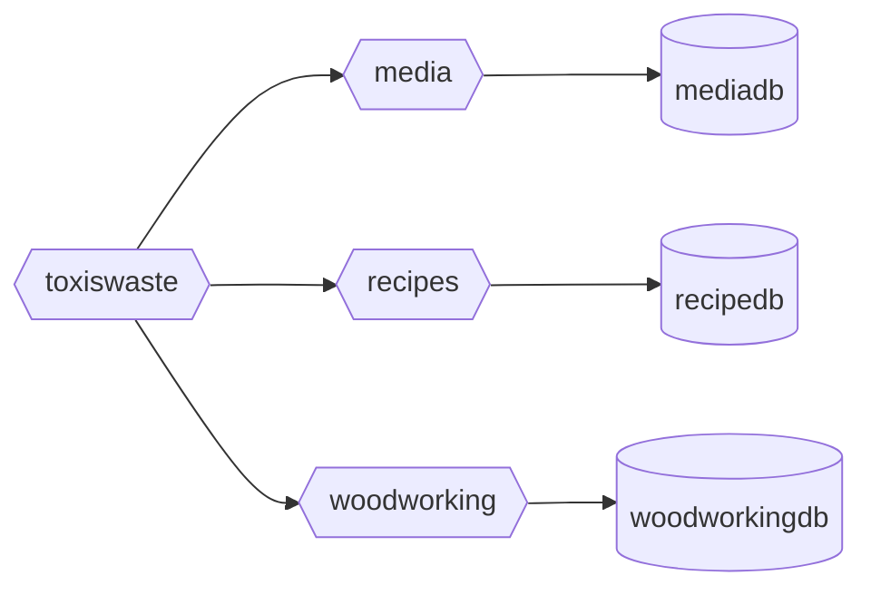

# toxiswaste

This repo is just a platground for `go` development and testing different architecture patterns.

It may or may not work if someone happens to clone and try it.

## HL Arch
`toxiswaste` is the web interface that will interact with various microservices.

